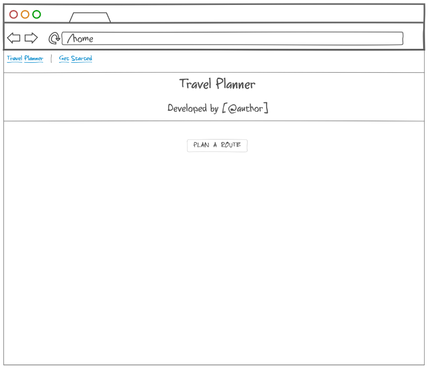
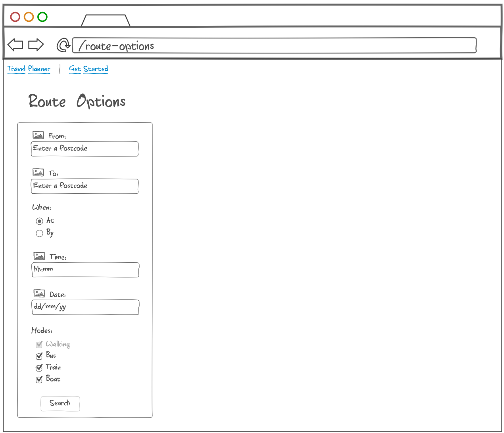
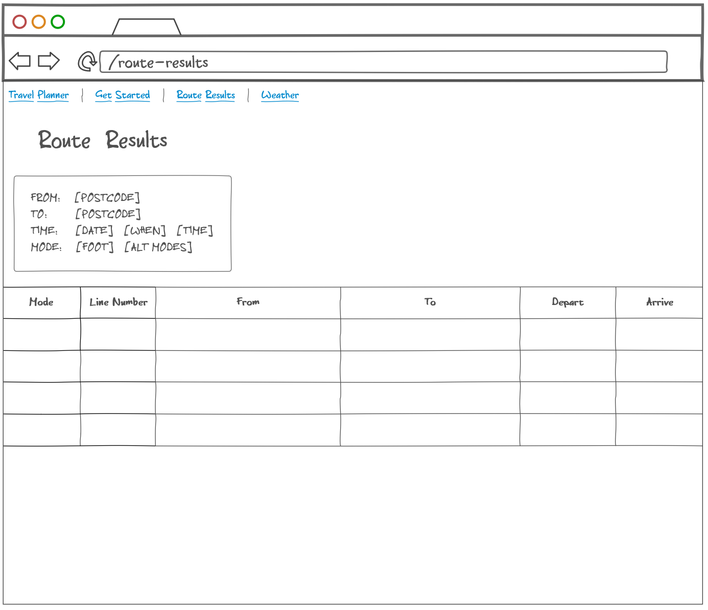
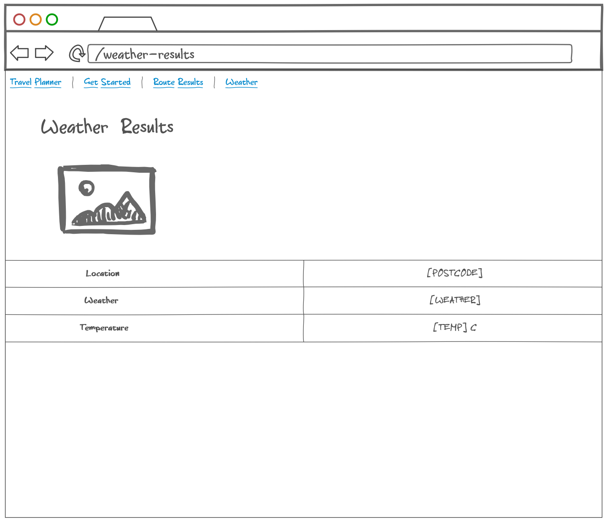

# Route Planner and Weather Information using Flask

## Features
 - Menu screen w/ forms
 - Dynamic web pages
 - Route planner between 2x UK postcodes
    - Select 'From' postcode
    - Select 'To' postcode
    - Select 'When' (arrive at or leave by)
    - Select a time (optional)
    - Select a date (optional)
    - Select a mode of transport
        - Walk (required)
        - Bus (optional)
        - Train (optional)
        - Ferry (optional)
    - Provides current weather and temperature at destination w/ image
    - Verification and full error handling
        - Site 404 & 500 errors
        - API errors
        - Standard form verification (check postcodes, date, time, etc)
        

> Application demo

## Requirements and Installation
 - [Python 3.x](https://www.python.org/)
 - Install all dependencies from the requirements.txt file. `pip install -r requirements.txt`
 - To use the application, API credentials are required and stored as [environment variables within your OS]((https://docs.microsoft.com/en-us/windows/win32/shell/user-environment-variables)).
    - [Transport API](https://developer.transportapi.com/)
        - APP ID as `TRANSPORT_ID`
        - APP Key as `TRANSPORT_KEY`
    - [OpenWeather API](https://openweathermap.org/api)
        - APP Key as `OPENWEATHER_KEY`

## Usage
 - Run app.py

## Changelog
#### Version 1.0 - Initial release
 - Route Planner
 - Weather Information
 
&nbsp;
## Planning & Development

&nbsp;

> Original menu concept

&nbsp;

> Web form concept

&nbsp;

> Travel results page concept

&nbsp;

> Weather results page concept